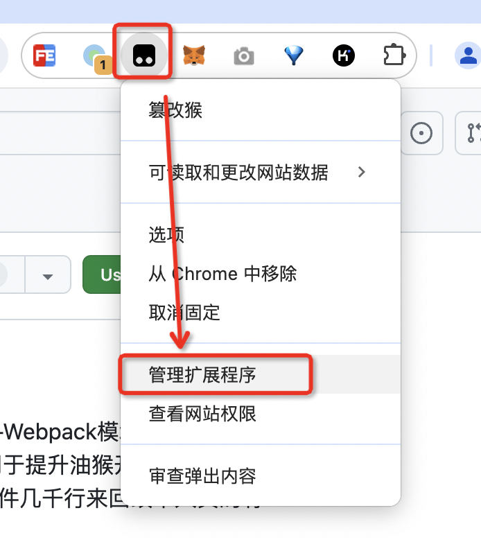
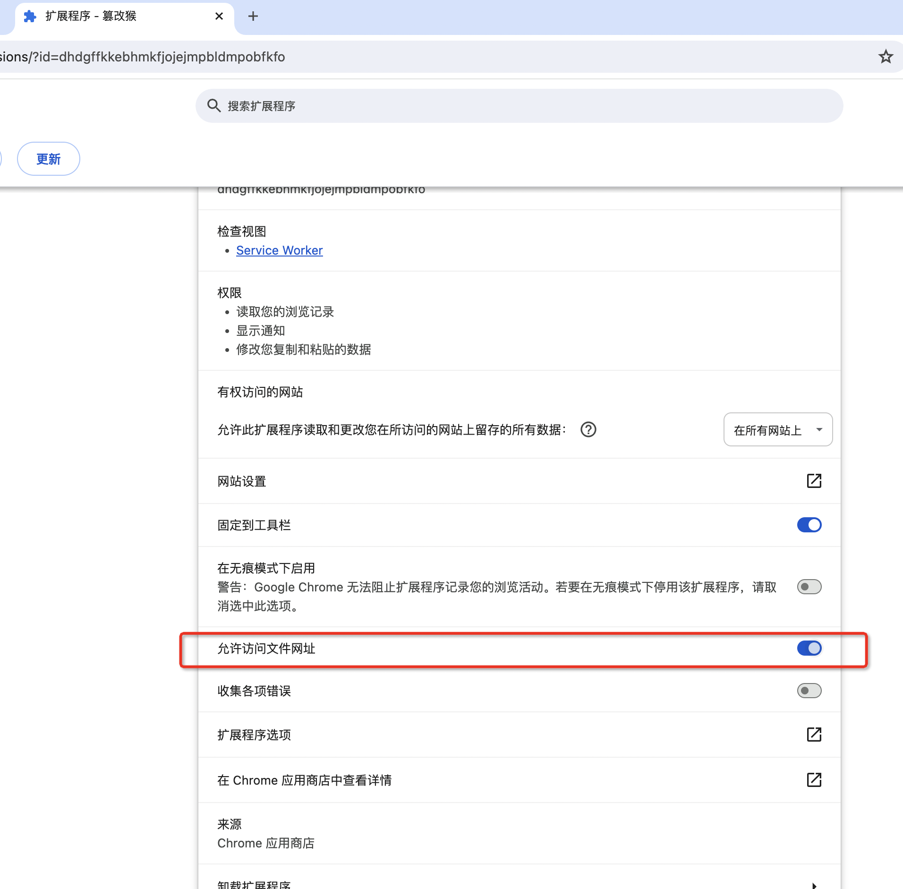

# UserScript Template 

[简体中文](./README.md) | English

# 1. What is this?

A plan for using `Node.js` + `Webpack` for modular development of Tampermonkey scripts, aimed at improving the development experience of Tampermonkey, reducing the mental burden during development, and allowing Tampermonkey scripts to be developed like a regular modular front-end project. Otherwise, a `JavaScript` file with thousands of lines to be modified back and forth is really too much to handle...

# 2. Advantages

- Modular development of Tampermonkey projects can greatly enhance both the development experience and efficiency. You no longer have to worry about how to organize code within a single `JavaScript` file (Tampermonkey scripts uploaded to the Tampermonkey store must be single files without obfuscation or compression, and the JS files produced by modular development and packaging also meet the requirements for uploading).
- Hot module replacement (HMR) during development increases efficiency. By adopting the recommended development mode, Tampermonkey points to the local file address of the packaged results. When there are changes in the `JavaScript` code, it automatically compiles and packages the load, making it more efficient to modify and test code during development (those who have written Tampermonkey scripts should have experienced the frustration of spending a lot of time modifying and testing code back and forth, which is really exhausting).
- When publishing, the packaged result is a single `JavaScript` file with high readability, which complies with the Tampermonkey store's policy for listing scripts. The packaged file is ready for listing without the need for any manual processing work, making it simple, convenient, and hassle-free.

# 3. Quick Start

To quickly get started with the project template, follow these steps:

1. Go to the repository at [https://github.com/JSREI/userscript-template](https://github.com/JSREI/userscript-template).
2. Click on the "Use this template" button.
3. Then, select "Create a new repository" to create a new repository from this template.

This process will set up a new repository for your project, using the structure and files provided by the template. If you encounter any issues with the link or the process, ensure that the link is correct and that you have a stable internet connection. If the problem persists, you may need to check for any updates or changes to the repository or try again later.


Choose the location for the new repository and set the repository name, among other settings. Typically, it's convenient to place the new repository under your own account:

1. After clicking "Create a new repository," you'll be prompted to choose the owner of the repository. It's common to select your own GitHub account.
2. Enter a name for your new repository that reflects its purpose or content.
3. Optionally, you can add a short description of the repository.
4. Choose whether the repository should be public or private.
5. Decide if you want to include a README file, .gitignore, and a license.
6. Click the "Create repository" button to finalize the creation process.

This will create a new repository with the specified settings, ready for you to start your project development.


The new repository has been created and cloned to your local machine. Then, in the root directory of the cloned project, execute the command to install the project's required dependencies:

```bash
npm install
```

The installation of dependencies may take some time; please be patient and wait a moment.


If the installation of dependencies is too slow or the downloads are not coming through, you can configure a domestic mirror source for `npm` or use `cnpm` (search for it on Google yourself).

Then, modify the `package.json` file, replacing the relevant fields with your own, such as the name, author, repository address, and so on:

```js
{
  "name": "userscript-foo",
  "version": "0.0.1",
  "main": "index.js",
  "repository": "https://github.com/JSREI/userscript-template.git",
  "scripts": {
      // ... 
  },
  "author": "CC11001100 <CC11001100@qq.com>",
  "license": "MIT",
  "devDependencies": {
      //...
  }
}
```

In the `userscript-headers.js` file located in the project's root directory, the default Tampermonkey headers are stored. During the `webpack` compilation, this file is placed at the beginning of the compiled file as the Tampermonkey plugin declaration:

```js
// ==UserScript==
// @name         ${name}
// @namespace    ${repository}
// @version      ${version}
// @description  ${description}
// @document     ${document}
// @author       ${author}
// @match        *://*/*
// @run-at       document-start
// ==/UserScript==
```

`${name}`, `${version}`, and similar are some of the variables supported by this Tampermonkey scaffold. The principle is that during compilation, the corresponding values are obtained from `package.json` and the variables are replaced (this is called variable rendering). This way, for content that might be repeated or constantly changing, we can use a single source reference without having to set or repeatedly modify it. If the default configuration does not meet your requirements, you can directly modify this header file, for example, to add permissions:

```js
// ==UserScript==
// @name         ${name}
// @namespace    ${repository}
// @version      ${version}
// @description  ${description}
// @document     ${document}
// @author       ${author}
// @match        *://*/*
// @run-at       document-start
// @grant        GM_getValue
// @grant        GM_setValue
// @grant        GM_registerMenuCommand
// @grant        GM.getValue
// @grant        GM.setValuex
// @grant        GM.registerMenuCommand
// ==/UserScript==
```

In addition to variable substitution, all other content will be preserved as is, this is what the compiled version looks like:


Then you can happily start coding. While writing code, you can use the `npm` command to add dependencies to your project. For a slightly more complex script, it is very likely to reference external dependencies:

```bash
npm add xxx
```

However, it is important to note that these dependencies will ultimately be packed into `./dist/index.js`, and this file should not be too large, so try to avoid referencing too many third-party libraries.

At the same time, you can now organize your code in a modular way under the `src` directory, instead of struggling with a single `JavaScript` file that is thousands of lines long as before (single-file development is simply a form of mental torture...):


When you need to test, execute:

```bash
npm run watch
```

Then copy the file header from `./dist/index.js` to your Tampermonkey extension:


And at the end, add a line to import the compiled file, noting that the `file://` followed by the address points to the absolute path of your compiled `./dist/index.js`:

```js
// @require    file://D:/workspace/userscript-template/dist/index.js
```

For example, here is an actual example of a Tampermonkey script used during development. The Tampermonkey script does not contain actual code but uses `require` to point to our `build` files. This way, when the code is modified and `webpack` automatically hot compiles, the `./dist/index.js` referenced in the browser is also the latest:

```js
// ==UserScript==
// @name         userscript-foo
// @namespace    https://github.com/JSREI/userscript-template.git
// @version      0.0.1
// @description  
// @document     
// @author       CC11001100 <CC11001100@qq.com>
// @match        *://*/*
// @run-at       document-start
// @require    file://D:/workspace/userscript-template/dist/index.js
// ==/UserScript==
(() => {})();
```

Please note that when you debug using the method `// @require    file://D:/workspace/userscript-template/dist/index.js`, your Tampermonkey extension should be configured to allow access to file URLs (by default, it is not allowed). Right-click on the browser plugin icon and select "Manage Extensions":



Make sure that the "Allow access to file URLs" switch is turned on; otherwise, `@require` will not be able to reference local files:



You might notice that when you run `npm run watch`, the command does not exit after compiling the code but instead enters a waiting state. Yes, just as its name suggests, it activates a `watch` mode. When you modify the source code files, `webpack` will recompile your code for you. All you need to do is directly modify your source code files, make the changes, then switch to the browser and refresh the page for the changes to take effect! (There is no automatic browser refresh introduced here. Is it necessary? To be honest, it is necessary, but I don't really know how to set it up, so let's just make do with what we have....)

When you need to publish:

```bash
npm run build
```

Then simply take the `./dist/index.js` file and publish it.


